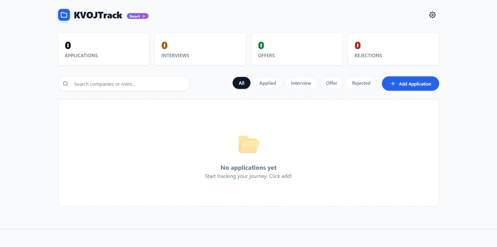
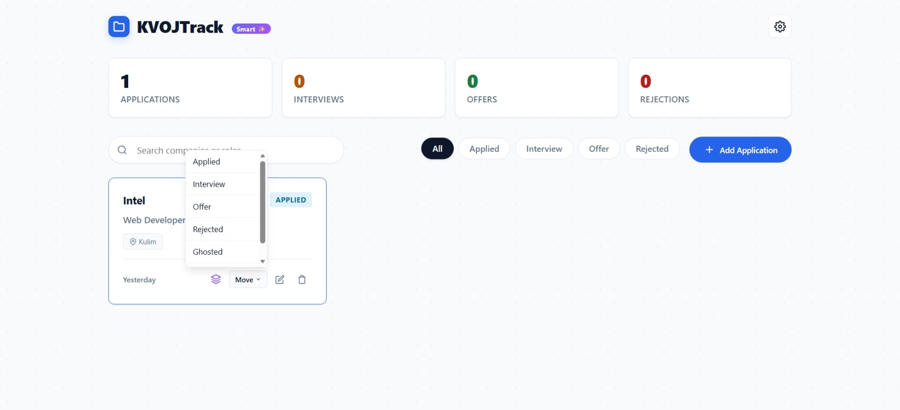
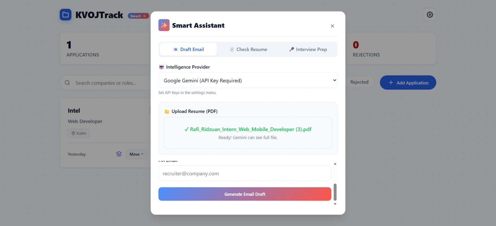
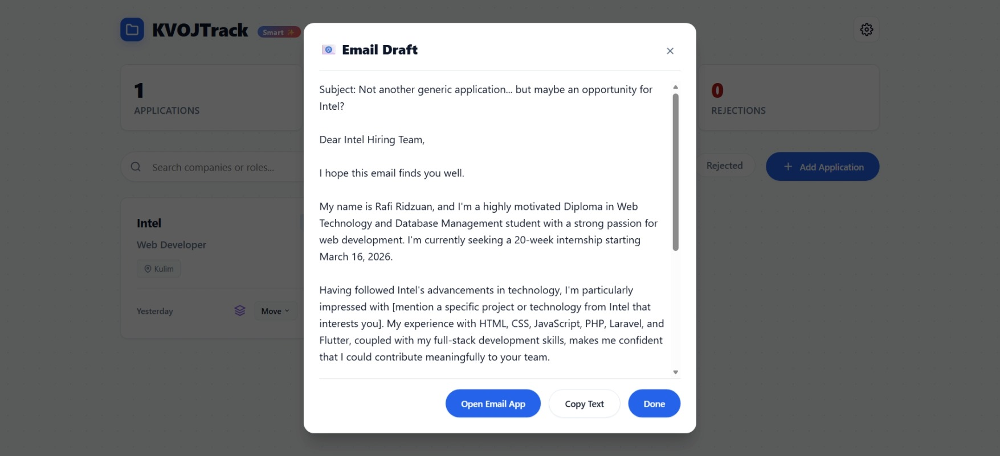
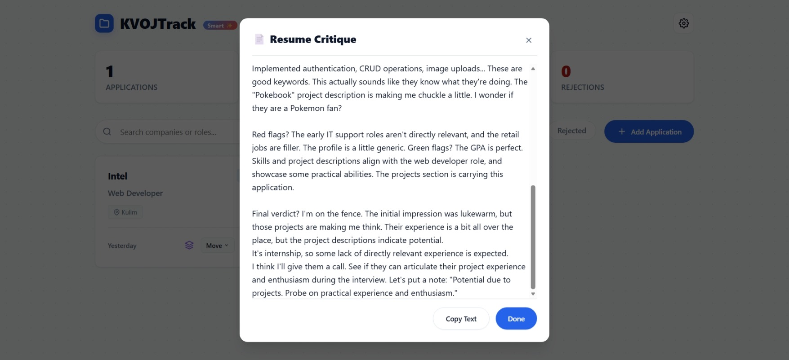

# **KVOJTrack**

A clean, lightweight, and smart internship application tracker. No login, no servers, just your browser.

**🔗 Live Demo:** [https://kvojtrack.netlify.app/](https://kvojtrack.netlify.app/)

## **Overview**

**KVOJTrack** is designed to keep your internship hunt organized without the hassle of signing up for yet another service. It runs entirely in your browser, ensuring your data stays with you.

## 📸 Application Screenshots

| Change Status | Smart Assistant|
| :---: | :---: |
|  |  |
| **Output Email AI Generator** | **AI Pretend Be HR** |
|  |  |

---

*Note: Images are located in the docs/ folder.*

## **Features**

* **Zero Setup:** Just open index.html in your browser. No installation required.  
* **Privacy First:** All data is stored locally in your browser (**localStorage**). Nothing is sent to any server.  
* **Smart Tracking:** Visualize your application status with clear indicators:  
  * 🔵 **Applied**  
  * 🟡 **Interview**  
  * 🟢 **Offer**  
  * 🔴 **Rejected**  
* **Import/Export:**  
  * Backup your data to **JSON**.  
  * Import existing data from **Excel (CSV)**.  
* **Clean UI:** Distraction-free interface focused on productivity.

## **How to Use**

1. **Download** the index.html file.  
2. **Open** the file in any modern web browser (Chrome, Edge, Firefox, Safari).  
3. Click the **Add Application** button to start tracking your internships\!

## **Technical Details**

Built with pure **HTML, CSS, and Vanilla JavaScript**.

* **No Frameworks**: Extremely lightweight and fast.  
* **No Build Steps**: Easy to modify and extend.  
* **PDF.js**: Integrated for future-proofing resume preview features.  
* **Local Storage**: Persists data between sessions automatically.

*Created for the organized job seeker.*
